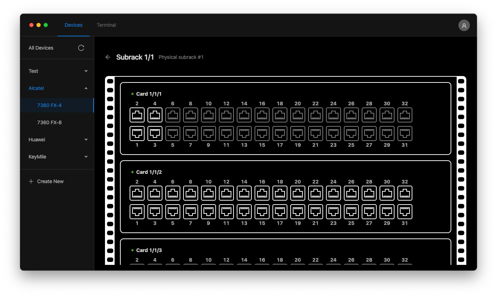
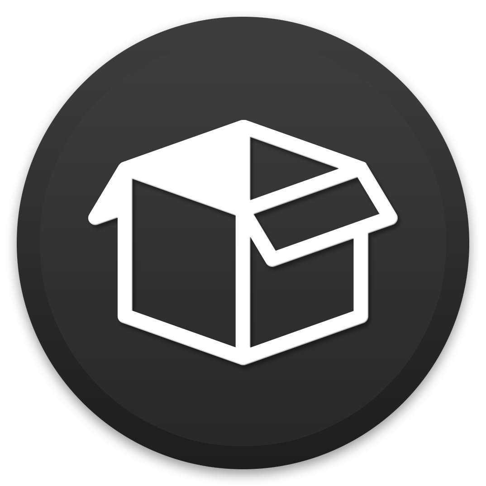

<p align="center">
    <a></a>
    <a></a>
    <a></a>
    <a></a>
</p>

<p align="center"><a href="https://github.com/inexio/NESi-UI/releases/latest">Download latest Release</a></p>

## Description

<a></a>

The NESi UI is both a Web and Desktop App used to manage and display data from virtual network devices managed by the main NESi application.

This tool is designed to work hand-in-hand with the main NESi Rest API running on a dedicated Server. This tool then communicates with the Endpoints of the NESi Rest API.

## Installation

For the installation of the core NESi Application, please visit [this page](https://github.com/inexio/NESi).

There are two seperate installation guides depending on whether you want to install the NESi UI on a Web Server and make it
accessible through the browsers or if you want to run it as a local app on your Desktop, which updates itself automatically.

### Web App

<details>
    <summary>Installation Guide</summary>
    <br>
    <ul>
        <li>
            First things first, you need to have a Web Server such as Nginx or Apache installed already (Express works too, as long as its set up to serve static files).
        </li>
        <li>
            The second step is to go to the <a href="https://github.com/inexio/NESi-UI/releases/latest">latest release</a> and download the <a href="https://github.com/inexio/NESi-UI/releases/latest">NESi-X.X.X.zip</a>-file which includes all the files needed for the deployment of the Web App.
        </li>
        <li>
            Last but not least, extract the files contents and upload them onto your web server. Please note, that the prebuild Web App can only run in the root directory of the web server!
        </li>
        <li>
             That's it! 🎉 You should now be able to go to your configured domain (or the IP Address) of your web server and get started.
        </li>
    </ul>
</details>

### Desktop App

<details>
    <summary>Installation Guide</summary>
    <br>
    <ul>
        <li>
            First, go to the <a href="https://github.com/inexio/NESi-UI/releases/latest">latest release</a> and click on "Assets". There you can download the latest version for your operating system.
        </li>
        <li>
            This will download an installer which lets you choose where to install the NESi UI and also where future updates will be installed.
        </li>
        <li>
            That's it! 🎉 You should now be able to open the App and continue with the initial setup!
        </li>
    </ul>
</details>

## Run or Build from Source

You can of course also run and build the app from source!

First, clone this repository and install its dependencies

```sh
$ git clone git@github.com:inexio/NESi-UI.git
$ cd NESi-UI/
$ npm install
```

After that's done, you can run the following npm package scripts to run or build the app:

```sh
# Run the App in development mode
$ npm run serve:web       # Run the Web App with hot reloading
$ npm run serve:desktop   # Run the Desktop App with hot reloading

# Build the App for production
$ npm run build:web       # Build the Web App
$ npm run build:mac       # Build the Desktop App for Mac
$ npm run build:win       # Build the Desktop App for Windows
$ npm run build:linux     # Build the Desktop App for Linux
```

## Authors

-   **Juri Adams** - _Initial Work_ - [@4dams](https://github.com/4dams)

## License

This project is underlying the BSD 2-Clause-License. For more information, take a look at this projects LICENSE.md file.
